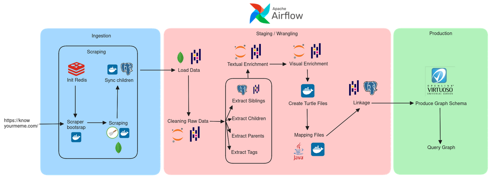
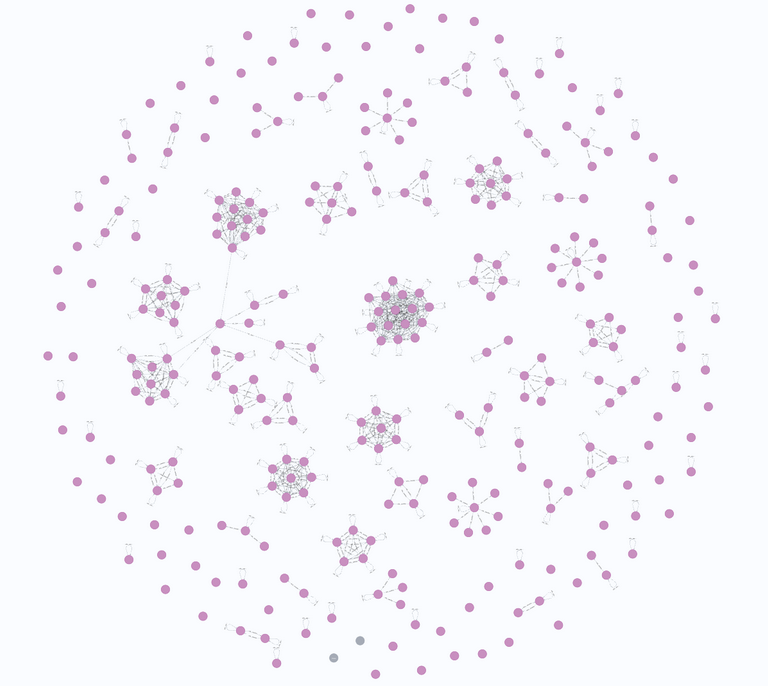

# Data Engineering Project: Memes

Welcome to the Memes Data Engineering Project! This repository is dedicated to the pipeline that ingests, cleanses, transforms, and enhances raw meme data from Know Your Meme, Imgflip and Wikidata.

## Table of Contents

1. [Introduction](#introduction)
2. [Ingesting](#ingesting)
3. [Cleansing](#cleansing)
4. [Transforming](#transforming)
5. [Enhancing](#enhancing)
6. [Production](#production)
7. [Futur improvements](#futur-improvements)
8. [Project Submission Checklist](#project-submission-checklist)
9. [How to use](#how-to-use)

## Introduction

Questions formulated for analyzing the meme dataset:

1. **Top 3 movies which generated the most memes**: Find out which movies have produced the most memes in our dataset.

2. **Is there more animals than humans used in memes?**: Discover whether animals are more prevalent than humans in memes.

## Pipeline



## Ingesting

In the initial phase of our data engineering project, we set up a pipeline to bring raw meme data into our landing zone, which is a MongoDB database. To do this, we created two scraper to collect data from KnowYourMeme and Imgflip.

The `KYM_Scraper` and `Imgflip_Scraper` are `scrapy` projects that scrapes the Know Your Meme and Imgflip websites for memes and their associated data.
The scrapper use a `Redis` database to store the URLs to be scraped and store the scraped data in a `MongoDB` database.
Relationships between memes (e.g. parent-child) are stored in a `PostgreSQL` database before updating the `MongoDB` documents.

Here is the link to the tools : 

- https://github.com/meme-schievous/kym-scrapper
- https://github.com/meme-schievous/imgflip-scraper

## Cleansing

For wrangling the data, we use different operators in airflow :

| OPERATORS         | URL DOCUMENTATION                                                                                        |
| ----------------- | -------------------------------------------------------------------------------------------------------- |
| PythonOperator    | https://airflow.apache.org/docs/apache-airflow/stable/howto/operator/python.html                         |
| PapermillOperator | https://airflow.apache.org/docs/apache-airflow/1.10.10/howto/operator/papermill.html                     |
| DockerOperator    | https://airflow.apache.org/docs/apache-airflow/1.10.10/_api/airflow/operators/docker_operator/index.html |
| BashOperator      | https://airflow.apache.org/docs/apache-airflow/stable/howto/operator/bash.html                           |

Then, for cleaning the data, we use the file `notebook/Cleaning.ipynb` and the operator `PapermillOperator` to run the file.
It  cleans both KYM data, by removing non-meme data type, removing duplicated fields and grouping content text, and Imgflip data, by changing URL structure.

## Transforming

For transforming the data, we use multiple files, namely `notebook/Extract_Children.ipynb`, `notebook/Extract_Parent.ipynb`, `notebook/Extract_Sibling.ipynb`, `notebook/Extract_Taxonomy.ipynb` and `notebook/Extract_Seed.ipynb` (THis one is only used to get the seed memes from Wikidata). With those files, we actually extract all the children, parents, siblings and taxonomy of memes to then use them later for the graph.

## Enhancing

For enhancing the data, we use the files `notebook/Enrich_Tags.ipynb.ipynb` and `notebook/Enrich_Text.ipynb.ipynb`, to enrich the data with Dbpedia Spotlight data to improve our dataset.
We have not yet implemented the enriching of the vision of our dataset with the GoogleApi since we did not have the means to pay for the service.

## Production

Now that we have the dataset, we can use the tool Virtuoso to query it and try and answer the introduction questions we formulated in the introduction (link to the tool on our github : https://github.com/meme-schievous/virtuoso).

We also imported the tuples into a Neo4J instance to have a visual representation of the resulting graph.



## Futur improvements

- Adding vision enrichment with GoogleApi with updated data.
- Refine the scrapping to have the option to scrap a given list of memes.

## Project Submission Checklist

- [x] Repository with the code, well documented
- [x] Docker-compose file to run the environment
- [x] Detailed description of the various steps
- [x] Report with the project design steps divided per area
- [x] Example dataset: the project testing should work offline, i.e., you need to have some sample data points.
- [x] Slides for the project presentation. You can do them too in markdown too.
- [x] Use airflow + pandas + mongodb + postgres + neo4j
- [x] Using REDIS for speeding up steps
- [x] Launching docker containers via airflow

## How to use

If you'd like to run the code for this project **OFFLINE**, follow these steps:

1. Make sure you have Docker installed.

2. Run the following commands:

   ```bash
   mkdir -p ./dags ./logs ./plugins ./config
   echo -e "AIRFLOW_UID=$(id -u)" > .env
   docker compose build
   docker compose up airflow-init
   docker compose -f docker-compose.yaml up
   ```

3. Go to http://localhost:8080/ (Username: airflow | Password: airflow)

4. Launch the dag : **imkg_offline.py**

If you'd like to run the code for this project **ONLINE**, follow these steps:

1. Make sure you have Docker installed.

2. Run the following commands:

   ```bash
   mkdir -p ./dags ./logs ./plugins ./config
   echo -e "AIRFLOW_UID=$(id -u)" > .env
   docker compose build
   docker compose up airflow-init
   ```

3. Run other commands to initialize the scrappers:

   ```bash
   docker build -t kym-scraper scraping/kym-scrapper
   docker build -t imgflip-scraper scraping/imgflip-scraper
   ```

4. Run: 

   ```bash
   docker compose -f docker-compose.yaml up
   ```

5. Go to http://localhost:8080/ (Username: airflow | Password: airflow)

6. Launch the dag : **imkg_online.py**

If you'd like to run the code only the scrappers to gather data, follow the steps for the **ONLINE** dag, but on step 6, use the **imkg.py** dag.

